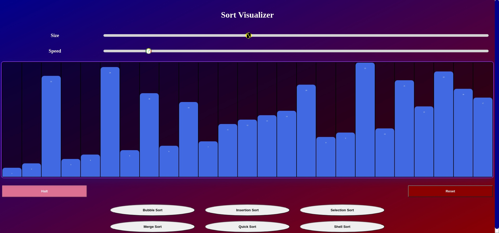
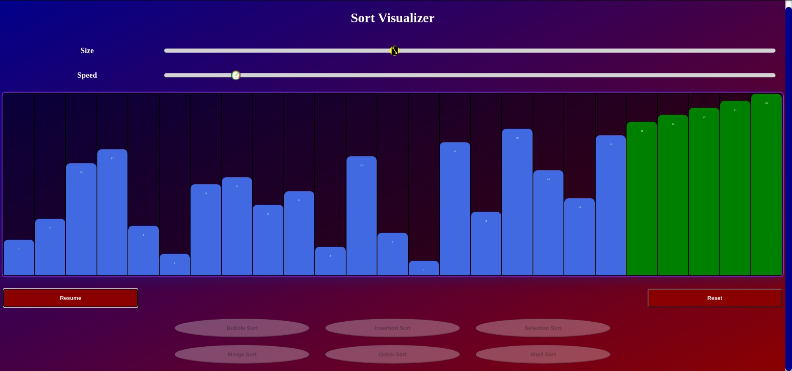

# Sort Visualizer

## This Project is a Sort Visualizer to visualize the sorting algorithms in data structures.
### The following sorts are supported :-
1. Bubble Sort
2. Insertion Sort 
3. Selection Sort
4. Merge Sort
5. Quick Sort
6. Shell Sort

The project is hosted on :-
<a href="https://sort-simulator-6118d.web.app/">https://sort-simulator-6118d.web.app/</a>

